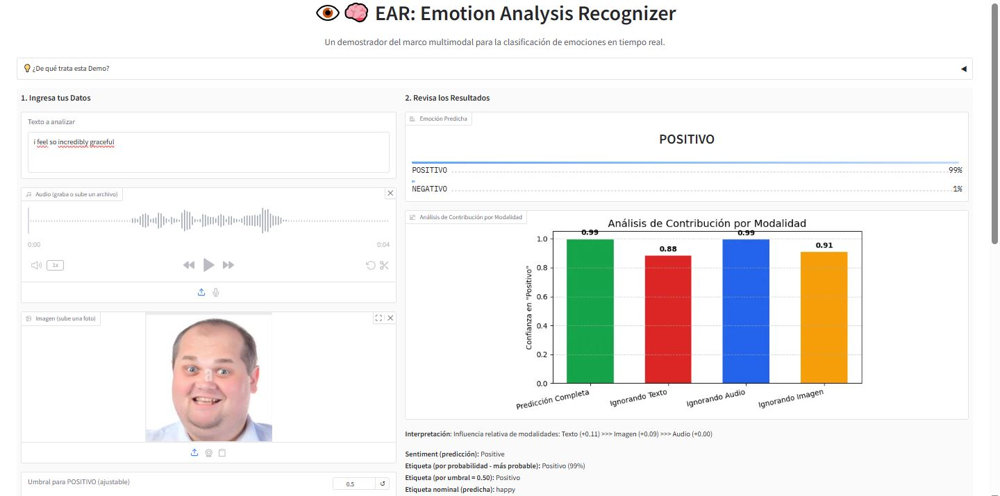

# 🎯 Proyecto: **MAREA-UI — Interfaz Multimodal de Análisis de Emociones en Tiempo Real**

**Tipo de archivo:** Python · TensorFlow/Keras · HuggingFace · Librosa · OpenCV
**Frameworks:** TensorFlow/Keras 2.19.0 · HuggingFace Transformers 4.55.4 · Librosa/soundfile · OpenCV/PIL

---

## 📑 Descripción

**MAREA-UI** es una **interfaz demostrativa interactiva** que permite analizar **emociones en tiempo real (Positivo / Negativo)** a partir de entradas de **texto, audio e imagen**.

🔎 Aunque el modelo multimodal subyacente forma parte de un tema de **investigación académica** y su código **no se expone públicamente**, esta interfaz fue desarrollada como un **aporte propio**, enfocándose en la usabilidad, accesibilidad y la visualización de resultados.

El usuario puede:

* ✍️ Escribir un texto.
* 🎤 Grabar o subir un audio.
* 🖼️ Subir una imagen (rostro).
* Usar una, dos o las tres modalidades en cualquier combinación.

⚠️ **Aviso:** El backend del modelo corresponde a un trabajo académico con acceso restringido.
👉 Lo destacado en este proyecto es la **interfaz adaptativa y explicativa**.

---

## ⚙️ Flujo de Uso – Interfaz DEMO

1. **Ingresa tus Datos**
   Texto, audio y/o imagen.

2. **Analiza la Emoción**
   Presiona el botón **Analizar Emoción**.

3. **Interpreta los Resultados**

   * ✅ Predicción global (clase más probable en %).
   * ✅ Decisión binaria por umbral.
   * ✅ Contribución relativa por modalidad.
   * ✅ Visualización de salidas crudas para debugging.

---

## 🚀 Ejemplo de Resultados

* **Predicción Global:** Negativo (88%)
* **Umbral positivo (0.50)** → Resultado: Negativo
* **Fuente predominante:** Clasificador de Imagen
* **Modalidades usadas:** Texto ❌ | Audio ❌ | Imagen ✅

---

## 🎬 Demo en Acción

* 📹 **GIF de Ejemplo de la Interfaz en uso**
  

* 📸 **Capturas de Pantalla**
  
 
---

## 🔧 Características Clave de la Interfaz

* 🧠 **Integración multimodal**: conecta texto, audio e imagen en un solo flujo visual.
* 🔄 **Adaptativa en tiempo real**: ajusta dinámicamente la importancia de cada modalidad según disponibilidad.
* 📊 **Explicabilidad clara**: el usuario puede ver qué modalidad pesó más en la decisión.
* 🎨 **Diseño interactivo y accesible**: pensado para uso académico y demostrativo.

---

## 📚 Contexto Académico

* El motor multimodal subyacente se entrenó con:

  * 🎵 **RAVDESS** — audios emocionales (\~2,880 muestras).
  * 🙂 **AffectNet** — imágenes faciales etiquetadas.
  * 💬 **Reddit** — comentarios positivos/negativos.

📌 **Nota:** Estos datasets forman parte del marco académico; **el código del modelo no es público**.

---

## 📦 Estado del Proyecto

✅ **Prototipo funcional con interfaz demostrativa.**
🚫 **Código fuente y modelos entrenados accesibles solo bajo permiso.**

---

## 👤 Autor & Contacto

**Autor:** Gabriel Angel Castañeda Huaytalla
📧 **Correo:** [gabrielce992@gmail.com](mailto:gabrielce992@gmail.com)
📱 **Celular / WhatsApp:** +51 991 744 486 🇵🇪

